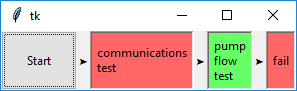
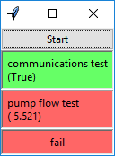
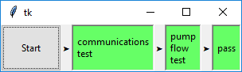

# Tk Manufacturing Automated Test System (TkMATS)

The [Manufacturing Automated Test System](https://github.com/slightlynybbled/mats) is a Python library
which provides useful structure for test creation and execution, but does not provide a user-defined
method of controlling that test environment.  The purpose of this project is to provide the
start button and to provide visual feedback as to the actual test that is executing.  The
implementation is done using a `tkinter.Frame` subclass which may be embedded into any tkinter-style
window.

# Installation

Installation is as easy as `pip install tkmats`.

# Usage

You must set up your test so that it can successfully execute on the 
[MATS](https://github.com/slightlynybbled/mats).  Once it is set up there, then you are just a couple
of lines away from converting an ATE-based test to a TkMATS.

We will start with the example application located within the ATE repository.  The high-level
functional bits are copied here for reference:

    # create the sequence of test objects
    sequence = [CommunicationTest(), PumpFlowTest()]
    ts = TestSequence(sequence=sequence, auto_run=False, loglevel=logging.DEBUG)

    # start the test as many times as you wish!
    for _ in range(3):
        ts.start()
        sleep(2.0)

Note that the test was simply started using the `TestSequence.start()` method.  Since we are
going to have a test frame that comes with TkMATS, then we won't require the automated start and
can, instead, rely on the user button supplied.  Our complete sequence could be as simple as:

    # create the sequence of test objects
    sequence = [CommunicationTest(), PumpFlowTest()]
    ts = TestSequence(sequence=sequence, auto_run=False, loglevel=logging.DEBUG)

    window = tk.Tk()

    tkmats_frame = TkMatsFrame(window, ts)
    tkmats_frame.grid()

    window.mainloop()

Note that most of the added code is related to simply creating the `window` object within
which the `TkMatsFrame` is to be embedded.

There are two tests that are executed here, one `CommunicationTest` and one `PumpTest`.  Screenshots
of various possible scenarios are shown here:

## Communications Test Failure

## Flow Test Failure

## All Passing

